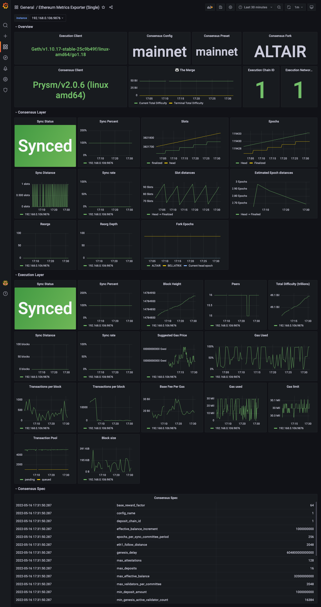

# 🦄 Ethereum Metrics Exporter 🦄

> A Prometheus metrics exporter for Ethereum execution & consensus nodes

Ethereum client implementations expose extensive Prometheus metrics however there is minimal standardization around the metrics structure. This makes observability across multiple clients a painful experience. This exporter hopes to help alleviate this problem by creating a client-agnostic set of metrics that operators can run without any additional configuration to dashboards or alerting.

To provide these client-agnostic metrics the exporter relies entirely on these well-defined APIs:
- Execution clients
  - [JSON-RPC](https://geth.ethereum.org/docs/rpc/server)
- Consensus clients
  - [Beacon Node API](https://ethereum.github.io/beacon-APIs/#/)

Naturally this means that the exporter is limited to metrics that are exposed by these APIs.

## Built With

* [pf13/cobra-cli](https://github.com/spf13/cobra-cli)
* [ethereum/go-ethereum](https://github.com/ethereum/go-ethereum)
* [attestantio/go-eth2-client](github.com/attestantio/go-eth2-client)
## Usage

```
A tool to export the state of ethereum nodes

Usage:
  ethereum-metrics-exporter [flags]

Flags:
      --config string                   config file (default is $HOME/.ethereum-metrics-exporter.yaml)
      --consensus-url string            (optional) URL to the consensus node
      --execution-modules strings       (optional) execution modules that are enabled on the node
      --execution-url string            (optional) URL to the execution node
  -h, --help                            help for ethereum-metrics-exporter
      --metrics-port int                Port to serve Prometheus metrics on (default 9090)
      --monitored-directories strings   (optional) directories to monitor for disk usage
  -t, --toggle                          Help message for toggle
```
## Getting Started

### Grafana
* [Single instance dashboard](https://grafana.com/grafana/dashboards/16277)

### Docker
Available as a docker image at `ethpandaops/ethereum-metrics-exporter`

#### Images
- `latest` - distroless, multiarch
- `latest` - debian - debian, multiarch
- `$version` - distroless, multiarch, pinned to a release (i.e. 0.4.0)
- `$version-debian` - debian, multiarch, pinned to a release (i.e. 0.4.0-debian)

**Quick start**
```
docker run -d -it --name ethereum-metrics-exporter -p 9090:9090 -it ethpandaops/ethereum-metrics-exporter --consensus-url=http://localhost:5052 --execution-url=http://localhost:8545
````
**With a config file**
```
docker run -d -it --name ethereum-metrics-exporter -v $HOST_DIR_CHANGE_ME/config.yaml:/opt/exporter/config.yaml -p 9090:9090 -it ethpandaops/ethereum-metrics-exporter --config /opt/exporter/config.yaml

```
### Kubernetes via Helm
[Read more](https://github.com/skylenet/ethereum-helm-charts/tree/master/charts/ethereum-metrics-exporter)
```
helm repo add ethereum-helm-charts https://ethpandaops.github.io/ethereum-helm-charts

helm install ethereum-metrics-exporter ethereum-helm-charts/ethereum-metrics-exporter -f your_values.yaml
```

### Standalone
**Downloading a release**
Available [here](https://github.com/ethpandaops/ethereum-metrics-exporter/releases)

**Building yourself (requires Go)**

1. Clone the repo
   ```sh
   go get github.com/ethpandaops/ethereum-metrics-exporter
   ```
2. Change directories
   ```sh
   cd ./ethereum-metrics-exporter
   ```
3. Build the binary
   ```sh  
    go build -o ethereum-metrics-exporter .
   ```
4. Run the exporter
   ```sh  
    ./ethereum-metrics-exporter
   ```

### Screenshots

## Contributing

Contributions are greatly appreciated! Pull requests will be reviewed and merged promptly if you're interested in improving the exporter! 

1. Fork the project
2. Create your feature branch:
    - `git checkout -b feat/new-metric-profit`
3. Commit your changes:
    - `git commit -m 'feat(profit): Export new metric: profit`
4. Push to the branch:
    -`git push origin feat/new-metric-profit`
5. Open a pull request

## Contact

Sam - [@samcmau](https://twitter.com/samcmau)
